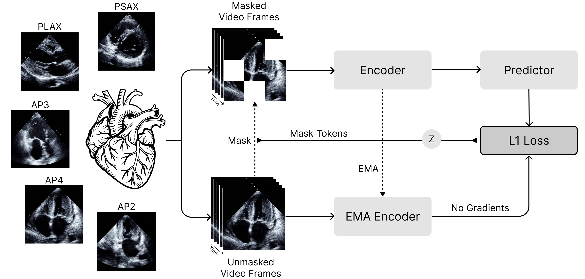

<h1 align="center"><b>EchoJEPA</b></h1>
<h3 align="center">A Latent Predictive Foundation Model for Echocardiography</h3>

<p align="center">
    <a href="https://arxiv.org/abs/2602.02603" target="_blank"></a>
    <a href="https://github.com/bowang-lab/EchoJEPA"></a>
    <a href="https://echojepa.com/"></a>
</p>


## Abstract
Foundation models for echocardiography often struggle to disentangle anatomical signal from the stochastic speckle and acquisition artifacts inherent to ultrasound. We present EchoJEPA, a foundation model trained on 18 million echocardiograms across 300K patients, representing the largest pretraining corpus for this modality to date. By leveraging a latent predictive objective, EchoJEPA learns robust anatomical representations that ignore speckle noise. We validate this using a novel multi-view probing framework with frozen backbones, where EchoJEPA outperforms state-of-the-art baselines by approximately 20% in left ventricular ejection fraction (LVEF) estimation and 17% in right ventricular systolic pressure (RVSP) estimation. The model also exhibits remarkable sample efficiency, reaching 79% view classification accuracy with only 1% of labeled data versus 42% for the best baseline trained on 100%. Crucially, EchoJEPA demonstrates superior generalization, degrading by only 2% under physics-informed acoustic perturbations compared to 17% for competitors. Most remarkably, its zero-shot performance on pediatric patients surpasses fully fine-tuned baselines, establishing latent prediction as a superior paradigm for robust, generalizable medical AI.

<p align="center">
	
</p>


EchoJEPA models trained on just 1% of labeled data outperform baselines trained on 100%. This efficiency implies that latent prediction yields dense representations capable of defining the view manifold with minimal supervision, as evidenced by the distinct anatomical clustering in the figure below.

<p align="center">
	
</p>


EchoJEPA demonstrates anatomical localization, focusing on the mitral valve leaflets, ventricular walls, and annulus while ignoring sector background. Received attention clusters at Doppler jet edges while given attention localizes on valve structures generating flow. Across the cardiac cycle, focus shifts from valve tips during opening to chamber walls during relaxation, indicating it interprets the echocardiogram as a functional biological system.

<p align="center">
	
</p>


## Getting Started

### Setup

```
conda create -n vjepa2-312 python=3.12
conda activate vjepa2-312
pip install .  # or `pip install -e .` for development mode
```

### Pretraining

Pretraining can also be run locally or distributed. Pretraining and cooldown training phases are run with the same command using different configs. These sample commands launch initial training of a ViT-L model on [MIMIC-IV-ECHO](https://physionet.org/content/mimic-iv-echo/0.1/), a dataset of 525K echocardiograms which can be accessed through PhysioNet.

#### Local

```
python -m app.main --fname configs/train/vitl16/pretrain-mimic-224px-16f.yaml \
  --devices cuda:0
```

#### Distributed

```
python -m app.main_distributed \
  --fname configs/train/vitl16/pretrain-mimic-224px-16f.yaml
  --time 6000
  --account my_account --qos=my_qos
```

#### Dataset Format

The pretrain dataset file needs to be set under `data.datasets` and looks something like this:

```
mimic-echo-224px/files/p10/p10002221/s94106955/94106955_0001.mp4 0
mimic-echo-224px/files/p10/p10002221/s94106955/94106955_0006.mp4 0
mimic-echo-224px/files/p10/p10002221/s94106955/94106955_0007.mp4 0
mimic-echo-224px/files/p10/p10002221/s94106955/94106955_0008.mp4 0
mimic-echo-224px/files/p10/p10002221/s94106955/94106955_0009.mp4 0
```

#### Pretrained Checkpoints

Since we are doing self-supervised pre-training, all the video labels are set to zero. You can begin pretraining from any of the pre-trained V-JEPA models below:
<table>
  <tr>
    <th colspan="1">Model</th>
    <th colspan="1">#Parameters</th>
    <th colspan="1">Resolution</th>
    <th colspan="1">Download Link</th>
    <th colspan="1">Pretraining Config</th>
  </tr>
  <tr>
    <td>ViT-L/16</td>
    <td>300M</td>
    <td>256</td>
    <td><a href="https://dl.fbaipublicfiles.com/vjepa2/vitl.pt">checkpoint</a></td>
    <td><a href="configs/train/vitl16">configs</a></td>
  </tr>
  <tr>
    <td>ViT-H/16</td>
    <td>600M</td>
    <td>256</td>
    <td><a href="https://dl.fbaipublicfiles.com/vjepa2/vith.pt">checkpoint</a></td>
    <td><a href="configs/train/vith16/">configs</a></td>
  </tr>
  <tr>
    <td>ViT-g/16</td>
    <td>1B</td>
    <td>256</td>
    <td><a href="https://dl.fbaipublicfiles.com/vjepa2/vitg.pt">checkpoint</a></td>
    <td><a href="configs/train/vitg16">configs</a></td>
  </tr>
  <tr>
    <td>ViT-g/16<sub>384</sub></td>
    <td>1B</td>
    <td>384</td>
    <td><a href="https://dl.fbaipublicfiles.com/vjepa2/vitg-384.pt">checkpoint</a></td>
    <td><a href="configs/train/vitg16">configs</a></td>
  </tr>
</table>

We keep the pretraining configuration mostly the same as in V-JEPA 2, but adjust some of the sampling and augmentation parameters for echocardiography:
```
app: vjepa
nodes: 1
tasks_per_node: 8
cpus_per_task: 16
mem_per_gpu: 220G
folder: checkpoints/pretrain/mimic/vjepa2_vitl_224px_16f
data:
  dataset_type: VideoDataset
  datasets:
  - /home/sagemaker-user/user-default-efs/vjepa2/data/csv/mimic_annotations_s3.csv # 525k echocardiogram video clips (224px)
  datasets_weights:
  - 1.0
  batch_size: 128
  crop_size: 224              # <--- thanks to RoPE scaling, this crop size is flexible, but we keep 224 to match with other models
  patch_size: 16
  dataset_fpcs:
  - 16                        # <--- frames per clip, 16 works well in practice
  fps: 8                      # <--- set this lower for greater temporal coverage, higher for greater fidelity
  tubelet_size: 2
  num_workers: 8
  persistent_workers: true
  pin_mem: true
data_aug:
  auto_augment: false
  motion_shift: false
  random_resize_aspect_ratio: # <--- We narrow this range from [0.75, 1.35]
  - 0.9 
  - 1.1 
  random_resize_scale:        # <--- We narrow this range from [0.3, 1.0]
  - 0.5
  - 1.0
```
If you are not training from scratch, set `optimization.checkpoint` to your downloaded checkpoint path. Make sure to scale your learning rates!


### Probe-based evaluation

Probe-based evaluation consists in training an attentive probe on top of frozen V-JEPA 2 features. We provide training scripts for training your own probes, and checkpoints to run inference directly.

<p align="center">
	
</p>


#### Classification Dataset Format

For classification, prepare a two-column CSV. It should be space-delimited, with the first column being the path to the MP4, and the second being your integer label.
```
data/echo_views_22k/19068955.mp4 5
data/echo_views_22k/19076133.mp4 7
data/echo_views_22k/19083831.mp4 2
data/echo_views_22k/19086809.mp4 2
data/echo_views_22k/19089161.mp4 5
```

#### Regression Dataset Format

For regression, we perform standard scaling (Z-score normalization) by fitting distribution parameters (mean and standard deviation) solely on the training data to prevent data leakage, then transform all data splits to a centered distribution with zero mean and unit variance to stabilize model optimization. You can use the following code:

```
import pandas as pd
import numpy as np
from sklearn.preprocessing import StandardScaler
import pickle

# 1. Initialize the Scaler
# We use StandardScaler to center the data (Mean=0, Std=1)
scaler = StandardScaler()

# 2. Fit ONLY on the Training Set
# This prevents information leakage from the future/test set
train_values = train_clean['Value'].values.reshape(-1, 1)
scaler.fit(train_values)

print(f"Scaler fitted. Mean: {scaler.mean_[0]:.4f}, Std: {scaler.scale_[0]:.4f}")

# 3. Transform All Splits
# We create a new column 'norm_value' which the model will try to predict
train_clean['norm_value'] = scaler.transform(train_clean['Value'].values.reshape(-1, 1))
val_clean['norm_value']   = scaler.transform(val_clean['Value'].values.reshape(-1, 1))
test_clean['norm_value']  = scaler.transform(test_clean['Value'].values.reshape(-1, 1))

# 4. Save the Scaler
# CRITICAL: You need this file to convert predictions back to real LVEF % later
with open('lvef_scaler.pkl', 'wb') as f:
    pickle.dump(scaler, f)

# --- Verification ---
print("\nNormalization Check (Train Set):")
print(train_clean['norm_value'].describe())
# Expected: Mean ~ 0.0, Std ~ 1.0

print("\nExample Data:")
print(train_clean[['Value', 'norm_value']].head(3))
```

The resulting CSV for train, val, and test should look something like this:

```
data/echo_a4c_lvef/2230801.mp4 -3.4486802913030026
data/echo_a4c_lvef/3260170.mp4 -0.16931876118450664
data/echo_a4c_lvef/2758271.mp4 0.7278549632852218
data/echo_a4c_lvef/4291596.mp4 0.7278549632852218
data/echo_a4c_lvef/2350500.mp4 -0.9335615677497962
data/echo_a4c_lvef/2351242.mp4 -0.9335615677497962
data/echo_a4c_lvef/2761632.mp4 -0.9335615677497962
data/echo_a4c_lvef/2351284.mp4 -0.9335615677497962
data/echo_a4c_lvef/3257799.mp4 -0.9335615677497962
data/echo_a4c_lvef/2759135.mp4 0.8186436513424096
```

Make sure to make a note of the mean and standard deviation of your dataset (or save the scaling pickle), as we will need these for inference. If you are preparing a multi-view dataset, the dataset will have additional columns for your videos. The last column is reserved for the label.

Now, we can prepare the training config. Here is an example config for regression
```
app: vjepa  
cpus_per_task: 32  
folder: /path/to/experiments/lvef_regression
mem_per_gpu: 80G  
nodes: 1  
tasks_per_node: 8  
num_workers: 8  
  
eval_name: video_classification_frozen  # <--- (MULTI-VIEW ONLY) Change this to video_classification_frozen_multi
resume_checkpoint: true  
tag: lvef-echonet-dynamic-112px
  
experiment:
  classifier:
    task_type: regression         # <--- Make sure to specify the task type is regression
    num_targets: 1                # <--- For regression, set the targets to 1
    num_heads: 16
    num_probe_blocks: 4

    # num_views: 2                # <--- (MULTI-VIEW ONLY) Number of total views (e.g. A4C.mp4, PSAX-AV.mp4)
    # clips_per_view: 2           # <--- (MULTI-VIEW ONLY) Number of clips to sample from each view (e.g. A4C_1, A4C_2, PSAX-AV_1, PSAX-AV_2)
    # use_slot_embeddings: true   # <--- (MULTI-VIEW ONLY) Use video stream embeddings
    # use_factorized: true        # <--- (MULTI-VIEW ONLY) Use factorized embeddings for clips and views
  
  data:  
    dataset_type: VideoDataset  
    dataset_train: data/csv/echonet_dynamic_train.csv 
    dataset_val:   data/csv/echonet_dynamic_val.csv
      
    resolution: 112               # <--- Thanks to RoPE, the resolution can be different from pretraining
    frames_per_clip: 16  
    frame_step: 2  
    num_segments: 2  
    num_views_per_segment: 1  

    target_mean: 57.06           # <--- Regression Mean
    target_std: 11.33            # <--- Regression Std

    # num_clips_per_video: 2     # <--- (MULTI-VIEW ONLY) Number of clips from each video 
    # miss_augment_prob: 0.10    # <--- (MULTI-VIEW ONLY) Prob to flip a PRESENT view to MISSING at train time
    # min_present: 1             # <--- (MULTI-VIEW ONLY) Keep at least this many views per study during augmentation
```

The settings are largely the same for classification, except we change `task_type: regression` to `task_type: classification` and we replace `num_targets: 1` with `num_classes: N`. 
For multi-view, set `model_kwargs.module_name` to `evals.video_classification_frozen_multi.modelcustom.vit_encoder_multiclip`. See `configs/eval/vitg-384` for more examples.

Evaluations can be run either locally, or distributed via SLURM. (Running locally is useful for debugging and validation).
Use provided training configs under "Evaluation Attentive Probes". These configs allow to train multiple probes in parallel with various optimization parameters.
Change filepaths as needed (e.g. `folder`, `checkpoint`, `dataset_train`, `dataset_val`) to match locations of data and downloaded checkpoints on your local filesystem.
Change \# nodes and local batch size as needed to not exceed available GPU memory.

##### Local

To run locally, specify the GPUs to use. For example, training an LVEF probe:
```
python -m evals.main --fname configs/eval/vitg-384/lvef/echojepa_lvef.yaml \
  --devices cuda:0 cuda:1
```

##### Distributed

```
python -m evals.main_distributed \
  --fname configs/eval/vitg-384/lvef/echojepa_lvef.yaml  \
  --time 8600 \
  --account my_account --qos=my_qos
```

Additional configs can be found for other tasks, including `configs/eval/vitg-384/view` and `configs/eval/vitg-384/rvsp`. Each directory has ready-made configs for PanEcho, EchoPrime, VideoMAE, and EchoJEPA. All that needs to be modified are the checkpoint and dataset paths. There are additional configs for EchoJEPA-L under `configs/eval/vitl`.


#### Probe inference

To do inference with a trained probe, you can use the inference configs under `configs/inference/vitg-384` or `configs/inference/vitl`. For example, performing inference using a trained LVEF probe:
```
python -m evals.main --fname configs/inference/vitl/lvef.yaml --devices cuda:0 cuda:1 cuda:2
```

For regression, these are the key parameters that need to be changed:
```
# --- CRITICAL INFERENCE SETTINGS ---
val_only: true       # <--- Ensure that this is set to true so the model is not being trained
predictions_save_path: /path/to/predictions.csv
probe_checkpoint: /path/to/probe.pt

experiment:
  classifier:              # <--- Keep identical to train config.
    task_type: regression  
    num_targets: 1         
    num_heads: 16
    num_probe_blocks: 4

  data:
    dataset_type: VideoDataset
    # Point 'dataset_val' to your TEST CSV
    dataset_val:   /path/to/test.csv
    dataset_train: /path/to/test.csv
    
    # Keep identical to training config
    resolution: 336
    frames_per_clip: 16
    frame_step: 2
    num_segments: 2
    num_views_per_segment: 1

    target_mean: 57.06   # <--- Regression Mean
    target_std: 11.33    # <--- Regression Std
```

For inference, we simply zero out the optimization parameters and set the `num_epochs` to 1. Batch size can be configured based on your GPU memory.
```
  optimization:
    # You can increase batch size for inference since gradients are off
    batch_size: 4
    
    # Zero out learning rates for safety (though val_only prevents updates anyway)
    multihead_kwargs:
    - final_lr: 0.0
      final_weight_decay: 0.0
      lr: 0.0
      start_lr: 0.0
      warmup: 0.0
      weight_decay: 0.0

    num_epochs: 1 # Run once
    use_bfloat16: true
    use_pos_embed: false
```

The other settings should be identical to your training config. See configs under `configs/inference/vitg-384` or `configs/inference/vitl` for more examples.


## Code Structure

```
.
├── app                                    # training loops
│   ├── vjepa                              #   video JEPA pre-training
│   ├── main_distributed.py                #   entrypoint for launch app on slurm cluster
│   └── main.py                            #   entrypoint for launch app locally on your machine
├── configs                                # config files with experiment params for training and evaluation
│   ├── train                              #   pretraining (phase 1), cooldown (phase 2), and action-conditioned training
│   └── eval                               #   frozen evaluations
├── evals                                  # evaluation loops training an attentive probe with frozen backbone...
│   ├── video_classification_frozen        #   single-view echocardiogram probes
│   ├── video_classification_frozen_multi  #   multi-view echocardiogram probes
│   ├── main_distributed.py                #   entrypoint for distributed evaluations
│   └── main.py                            #   entrypoint for locally-run evaluations
├── src                                    # the package
│   ├── datasets                           #   datasets, data loaders, ...
│   ├── models                             #   model definitions
│   ├── masks                              #   mask collators, masking utilities, ...
│   └── utils                              #   shared utilities
├── tests                                  # unit tests for some modules in `src`

```

## License

The majority of V-JEPA 2 is licensed under MIT, however portions of the project are available under separate license terms:

[src/datasets/utils/video/randaugment.py](src/datasets/utils/video/randaugment.py)<br>
[src/datasets/utils/video/randerase.py](src/datasets/utils/video/randerase.py)<br>
[src/datasets/utils/worker_init_fn.py](src/datasets/utils/worker_init_fn.py)<br>

are licensed under the Apache 2.0 license.


## Citation
**Alif Munim, Adibvafa Fallahpour, Teodora Szasz**, Ahmadreza Attarpour, River Jiang, Brana Sooriyakanthan, Maala Sooriyakanthan, Heather Whitney, Jeremy Slivnick, Barry Rubin, Wendy Tsang, Bo Wang

If you find this repository useful in your research, please consider giving a star :star: and a citation
```bibtex
@misc{munim2026echojepalatentpredictivefoundation,
      title={EchoJEPA: A Latent Predictive Foundation Model for Echocardiography}, 
      author={Alif Munim and Adibvafa Fallahpour and Teodora Szasz and Ahmadreza Attarpour and River Jiang and Brana Sooriyakanthan and Maala Sooriyakanthan and Heather Whitney and Jeremy Slivnick and Barry Rubin and Wendy Tsang and Bo Wang},
      year={2026},
      eprint={2602.02603},
      archivePrefix={arXiv},
      primaryClass={eess.IV},
      url={https://arxiv.org/abs/2602.02603}, 
}
```
