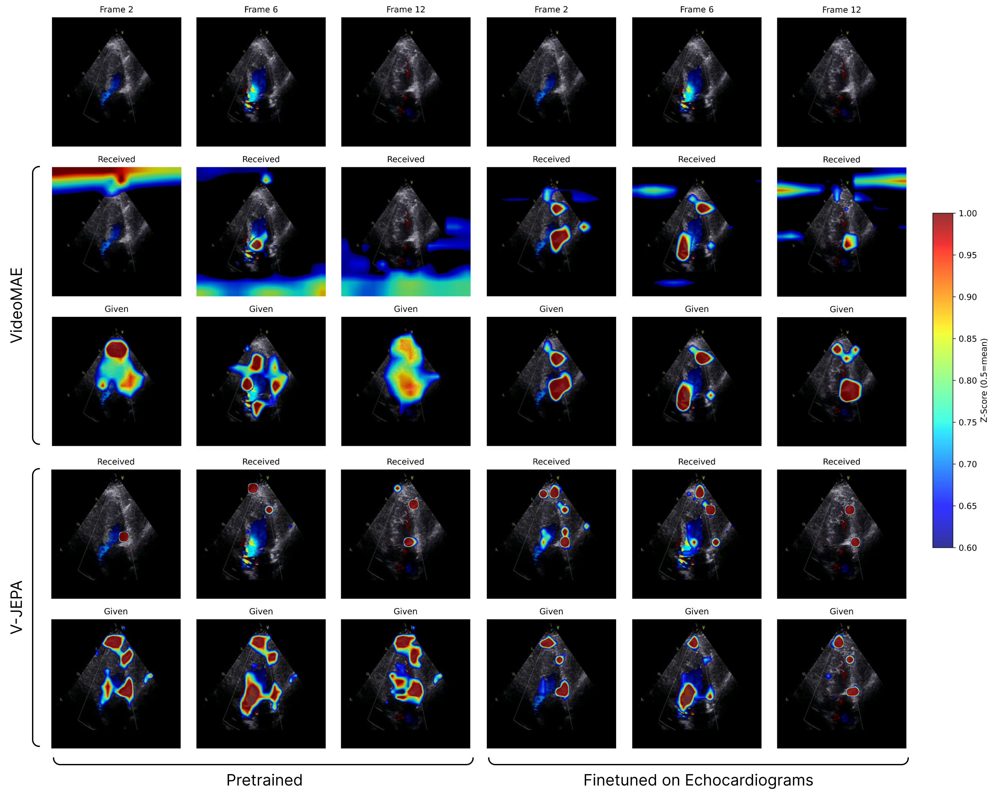

# EchoJEPA: A Latent Predictive Foundation Model for Echocardiography

Alif Munim, Adibvafa Fallahpour, Teodora Szasz, Ahmadreza Attarpour, River Jiang, Brana Sooriyakanthan, Maala Sooriyakanthan, Heather Whitney, Jeremy Slivnick, Barry Rubin, Wendy Tsang, Bo Wang

*Core Team

[[`Paper`]()] [[`Blog`]()] [[`BibTex`](#Citation)]

Official Pytorch codebase for EchoJEPA.

Foundation models for echocardiography promise to reduce annotation burden and improve diagnostic consistency by learning generalizable representations from large unlabeled video archives. However, current approaches fail to disentangle anatomical signal from the stochastic speckle and acquisition artifacts that dominate ultrasound imagery. We present EchoJEPA, a foundation model for echocardiography trained on 18 million echocardiograms across 300K patients, the largest pretraining corpus for this modality to date. We also introduce a novel multi-view probing framework with factorized stream embeddings that standardizes evaluation under frozen backbones. Compared to prior methods, EchoJEPA reduces left ventricular ejection fraction estimation error by 19% and achieves 87.4% view classification accuracy. EchoJEPA exhibits strong sample efficiency, reaching 78.6% accuracy with only 1% of labeled data versus 42.1% for the best baseline trained on 100%. Under acoustic perturbations, EchoJEPA degrades by only 2.3% compared to 16.8% for the next best model, and transfers zero-shot to pediatric patients with 15% lower error than the next best model, outperforming all fine-tuned baselines. These results establish latent prediction as a superior paradigm for ultrasound foundation models.

<p align="center">
	
</p>


## EchoJEPA 

<table>
  <tr>
    <th>Model</th>
    <th>Backbone</th>
    <th>Training Data</th>
    <th>Videos</th>
  </tr>
  <tr>
    <td>EchoJEPA-G</td>
    <td>ViT-G (1.1B)</td>
    <td>Proprietary</td>
    <td>18.1M</td>
  </tr>
  <tr>
    <td>EchoJEPA-L</td>
    <td>ViT-L (307M)</td>
    <td>MIMIC-IV-Echo</td>
    <td>525K</td>
  </tr>
  <tr>
    <td>EchoMAE-L†</td>
    <td>ViT-L (307M)</td>
    <td>MIMIC-IV-Echo</td>
    <td>525K</td>
  </tr>
</table>
<sup>†Compute-matched baseline for objective comparison.</sup>

#### Controlled Comparison

<table>
  <tr>
    <th>Model</th>
    <th>Objective</th>
    <th>LVEF MAE ↓</th>
    <th>View Acc ↑</th>
  </tr>
  <tr>
    <td>EchoMAE-L</td>
    <td>Reconstruction</td>
    <td>8.15</td>
    <td>40.4%</td>
  </tr>
  <tr>
    <td>EchoJEPA-L</td>
    <td>Latent Prediction</td>
    <td><b>5.97</b></td>
    <td><b>85.5%</b></td>
  </tr>
  <tr>
    <td colspan="2"><i>Relative Improvement</i></td>
    <td><i>-26.7%</i></td>
    <td><i>+45.1 pts</i></td>
  </tr>
</table>

#### LVEF Estimation

<table>
  <tr>
    <th>Model</th>
    <th>Toronto</th>
    <th>Chicago</th>
    <th>Stanford†</th>
  </tr>
  <tr>
    <td>EchoPrime</td>
    <td>5.33</td>
    <td>6.71</td>
    <td>4.87</td>
  </tr>
  <tr>
    <td>PanEcho</td>
    <td>5.43</td>
    <td>6.52</td>
    <td>5.45</td>
  </tr>
  <tr>
    <td>EchoMAE-L</td>
    <td>8.15</td>
    <td>9.40</td>
    <td>8.52</td>
  </tr>
  <tr>
    <td>EchoJEPA-L</td>
    <td>5.95</td>
    <td>7.39</td>
    <td>4.85</td>
  </tr>
  <tr>
    <td><b>EchoJEPA-G</b></td>
    <td><b>4.26</b></td>
    <td><b>5.44</b></td>
    <td><b>3.97</b></td>
  </tr>
</table>
<sup>†Probes trained and evaluated on the public EchoNet-Dynamic dataset splits.</sup>


#### Sample Efficiency on View Classification

<table>
  <tr>
    <th>Model</th>
    <th>1%</th>
    <th>10%</th>
    <th>100%</th>
  </tr>
  <tr>
    <td>EchoPrime</td>
    <td>21.6 ± 0.6</td>
    <td>32.1 ± 0.8</td>
    <td>42.1</td>
  </tr>
  <tr>
    <td>PanEcho</td>
    <td>21.5 ± 0.6</td>
    <td>30.6 ± 0.2</td>
    <td>41.9</td>
  </tr>
  <tr>
    <td>EchoMAE-L</td>
    <td>21.9 ± 1.3</td>
    <td>34.5 ± 1.2</td>
    <td>40.4</td>
  </tr>
  <tr>
    <td>EchoJEPA-L</td>
    <td>57.6 ± 0.7</td>
    <td>80.1 ± 0.9</td>
    <td>85.5</td>
  </tr>
  <tr>
    <td><b>EchoJEPA-G</b></td>
    <td><b>78.6 ± 1.2</b></td>
    <td><b>84.4 ± 0.1</b></td>
    <td><b>87.4</b></td>
  </tr>
</table>

#### Robustness to Acoustic Degradation
<table>
  <tr>
    <th rowspan="2">Model</th>
    <th rowspan="2">Original</th>
    <th colspan="3">Depth Attenuation</th>
    <th colspan="3">Gaussian Shadow</th>
    <th rowspan="2">Avg. Deg. ↓</th>
  </tr>
  <tr>
    <th>Low</th>
    <th>Med</th>
    <th>High</th>
    <th>Low</th>
    <th>Med</th>
    <th>High</th>
  </tr>
  <tr>
    <td>EchoPrime</td>
    <td>4.87</td>
    <td>5.58</td>
    <td>5.71</td>
    <td>5.91</td>
    <td>5.55</td>
    <td>5.61</td>
    <td>5.78</td>
    <td>+16.8%</td>
  </tr>
  <tr>
    <td>PanEcho</td>
    <td>5.10</td>
    <td>5.10</td>
    <td>5.39</td>
    <td>5.46</td>
    <td>5.19</td>
    <td>5.21</td>
    <td>5.38</td>
    <td>+3.7%</td>
  </tr>
  <tr>
    <td>EchoMAE-L</td>
    <td>8.52</td>
    <td>8.51</td>
    <td>8.57</td>
    <td>8.58</td>
    <td>8.56</td>
    <td>8.57</td>
    <td>8.57</td>
    <td>+0.5%†</td>
  </tr>
  <tr>
    <td>EchoJEPA-L</td>
    <td>5.76</td>
    <td>5.72</td>
    <td>5.91</td>
    <td>6.10</td>
    <td>5.79</td>
    <td>5.87</td>
    <td>5.97</td>
    <td>+2.3%</td>
  </tr>
  <tr>
    <td><b>EchoJEPA-G</b></td>
    <td><b>3.97</b></td>
    <td><b>4.01</b></td>
    <td><b>4.07</b></td>
    <td><b>4.17</b></td>
    <td><b>4.02</b></td>
    <td><b>4.04</b></td>
    <td><b>4.07</b></td>
    <td><b>+2.3%</b></td>
  </tr>
</table>
<sup>†EchoMAE-L shows minimal relative degradation because its baseline (8.52 MAE) is already poor.</sup>

#### Multi-View RVSP Estimation

<table>
  <tr>
    <th>Model</th>
    <th>Toronto</th>
    <th>Chicago</th>
  </tr>
  <tr>
    <td>EchoPrime</td>
    <td>5.65</td>
    <td>5.29</td>
  </tr>
  <tr>
    <td>PanEcho</td>
    <td>5.49</td>
    <td>5.26</td>
  </tr>
  <tr>
    <td>EchoMAE-L</td>
    <td>5.36</td>
    <td>5.60</td>
  </tr>
  <tr>
    <td>EchoJEPA-L</td>
    <td>5.01</td>
    <td>5.05</td>
  </tr>
  <tr>
    <td><b>EchoJEPA-G</b></td>
    <td><b>4.54</b></td>
    <td><b>4.91</b></td>
  </tr>
</table>

#### Adult to Pediatric Transfer

<table>
  <tr>
    <th>Model</th>
    <th>Zero-Shot</th>
    <th>Fine-Tuned</th>
  </tr>
  <tr>
    <td>EchoPrime</td>
    <td>5.10</td>
    <td>4.53</td>
  </tr>
  <tr>
    <td>PanEcho</td>
    <td>5.66</td>
    <td>5.34</td>
  </tr>
  <tr>
    <td>EchoMAE-L</td>
    <td>6.79</td>
    <td>6.75</td>
  </tr>
  <tr>
    <td>EchoJEPA-L</td>
    <td>6.31</td>
    <td>5.12</td>
  </tr>
  <tr>
    <td><b>EchoJEPA-G</b></td>
    <td><b>4.32</b></td>
    <td><b>3.88</b></td>
  </tr>
</table>


### EchoJEPA

<p align="center">
	
</p>


## Getting Started

### Setup

```
conda create -n vjepa2-312 python=3.12
conda activate vjepa2-312
pip install .  # or `pip install -e .` for development mode
```

### Probe-based evaluation

Probe-based evaluation consists in training an attentive probe on top of frozen V-JEPA 2 features. We provide training scripts for training your own probes, and checkpoints to run inference directly.

#### Training probes

Evaluations can be run either locally, or distributed via SLURM. (Running locally is useful for debugging and validation).
Use provided training configs under "Evaluation Attentive Probes". These configs allow to train multiple probes in parallel with various optimization parameters.
Change filepaths as needed (e.g. `folder`, `checkpoint`, `dataset_train`, `dataset_val`) to match locations of data and downloaded checkpoints on your local filesystem.
Change \# nodes and local batch size as needed to not exceed available GPU memory.

##### Local

To run locally, specify the GPUs to use on
```
python -m evals.main --fname configs/eval/vitl16/ssv2.yaml \
  --devices cuda:0 cuda:1
```

##### Distributed

```
python -m evals.main_distributed \
  --fname configs/eval/vitl/ssv2.yaml  \
  --time 8600 \
  --account my_account --qos=my_qos
```

### Pretraining

Likewise, training can also be run locally or distributed. Pretraining and cooldown training phases are
run with the same command using different configs.
These sample commands launch initial training of a ViT-L model. Configs for cooldown (or action-conditioned) training
can be found in the same directory as the config for initial training.

#### Local

```
python -m app.main --fname configs/train/vitl16/pretrain-256px-16f.yaml \
  --devices cuda:0
```

#### Distributed

```
python -m app.main_distributed \
  --fname configs/train/vitl16/pretrain-256px-16f.yaml
  --time 6000
  --account my_account --qos=my_qos
```

#### Local

```
python -m app.main --fname configs/train/vitg16/droid-256px-8f.yaml \
  --devices cuda:0
```

#### Distributed

```
python -m app.main_distributed \
  --fname configs/train/vitg16/droid-256px-8f.yaml
  --time 6000
  --account my_account --qos=my_qos
```


## Code Structure

```
.
├── app                                    # training loops
│   ├── vjepa                              #   video JEPA pre-training
│   ├── main_distributed.py                #   entrypoint for launch app on slurm cluster
│   └── main.py                            #   entrypoint for launch app locally on your machine
├── configs                                # config files with experiment params for training and evaluation
│   ├── train                              #   pretraining (phase 1), cooldown (phase 2), and action-conditioned training
│   └── eval                               #   frozen evaluations
├── evals                                  # evaluation loops training an attentive probe with frozen backbone...
│   ├── video_classification_frozen        #   single-view echocardiogram probes
│   ├── video_classification_frozen_multi  #   multi-view echocardiogram probes
│   ├── main_distributed.py                #   entrypoint for distributed evaluations
│   └── main.py                            #   entrypoint for locally-run evaluations
├── src                                    # the package
│   ├── datasets                           #   datasets, data loaders, ...
│   ├── models                             #   model definitions
│   ├── masks                              #   mask collators, masking utilities, ...
│   └── utils                              #   shared utilities
├── tests                                  # unit tests for some modules in `src`

```

## License

The majority of V-JEPA 2 is licensed under MIT, however portions of the project are available under separate license terms:

[src/datasets/utils/video/randaugment.py](src/datasets/utils/video/randaugment.py)<br>
[src/datasets/utils/video/randerase.py](src/datasets/utils/video/randerase.py)<br>
[src/datasets/utils/worker_init_fn.py](src/datasets/utils/worker_init_fn.py)<br>

are licensed under the Apache 2.0 license.


## Citation
If you find this repository useful in your research, please consider giving a star :star: and a citation
```bibtex
@article{munim2026echojepa,
  title={EchoJEPA: A Latent Predictive Foundation Model for Echocardiography},
  author={Munim, Alif and Fallahpour, Adibvafa and Szasz, Teodora and Attarpour, Ahmadreza and Jiang, River and Sooriyakanthan, Brana and Sooriyakanthan, Maala and Whitney, Heather and Slivnick, Jeremy and Rubin, Barry and Tsang, Wendy and Wang, Bo},
  journal={arXiv preprint arXiv:2602.XXXXX},
  year={2026}
}
```
